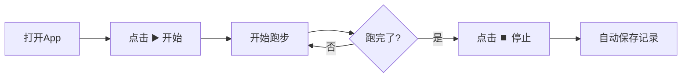

# 🏃 RunShare 跑步分享 - 用户使用说明书

## 📱 应用概述

**RunShare** 是一款功能丰富的Android跑步位置分享应用，类似于微信的位置共享功能。它能够实时追踪您的跑步轨迹，记录运动数据，并支持与好友分享位置。

---

## ✨ 核心功能

| 功能 | 说明 |
|------|------|
| 🗺️ **多地图支持** | OpenStreetMap、高德、百度、腾讯地图自由切换 |
| 📍 **实时位置追踪** | 后台持续追踪，精确记录跑步轨迹 |
| 📊 **跑步数据统计** | 实时显示距离、时长、配速 |
| 🔗 **位置分享** | 生成二维码/链接，好友可查看您的位置 |
| 📚 **历史记录** | 保存所有跑步记录，随时查看轨迹 |
| 📤 **轨迹导出** | 支持导出GPX格式文件 |
| 🌙 **深色模式** | Material You设计，支持深色主题 |

---

## 🚀 快速开始

### 1️⃣ 安装应用

1. 从GitHub Releases页面下载最新的 **APK文件**
2. 在手机上打开APK进行安装
3. 如提示"未知来源"，请在设置中允许安装

### 2️⃣ 授予权限

首次启动时，应用会请求以下权限：

| 权限 | 用途 | 必须 |
|------|------|------|
| 📍 精确位置 | 追踪跑步轨迹 | ✅ 必须 |
| 📍 后台定位 | 跑步时持续追踪 | ✅ 推荐 |
| 🔔 通知权限 | 显示跑步状态 | ⚠️ 建议 |

> ⚠️ **注意**：拒绝位置权限将无法使用核心功能

---

## 📖 界面说明

### 🏠 主界面（首页）


```
┌─────────────────────────────────┐
│  📜 历史          ⚙️ 设置      │  ← 顶部按钮
├─────────────────────────────────┤
│                                 │
│         🗺️ 地图区域            │  ← 显示当前位置和轨迹
│                                 │
├─────────────────────────────────┤
│  ┌─────────────────────────┐   │
│  │ 距离: 3.25 km           │   │  ← 跑步统计卡片
│  │ 时长: 18:30  配速: 5'40 │   │     (跑步中显示)
│  └─────────────────────────┘   │
│          ⏯️ 控制按钮            │  ← 开始/暂停/停止
└─────────────────────────────────┘
```

#### 控制按钮说明

| 状态 | 按钮 | 操作 |
|------|------|------|
| 未开始 | ▶️ **开始** | 点击开始跑步 |
| 跑步中 | ⏸️ **暂停** / ⏹️ **停止** | 暂停或结束跑步 |
| 已暂停 | ▶️ **继续** / ⏹️ **停止** | 继续跑步或保存记录 |

---

### 📚 历史记录

查看所有跑步记录，包含：

- 📅 **日期时间** - 跑步开始时间
- 📏 **距离** - 总跑步距离（公里）
- ⏱️ **时长** - 跑步用时
- 🏃 **配速** - 平均每公里用时

#### 操作选项

| 图标 | 功能 |
|------|------|
| 点击卡片 | 查看详细信息和轨迹地图 |
| 🔗 分享 | 将跑步数据分享给好友 |
| 🗑️ 删除 | 删除该条记录 |

---

### ⚙️ 设置

#### 🗺️ 地图设置

| 地图提供商 | 特点 |
|------------|------|
| **OpenStreetMap** | 默认选项，无需API Key，国际通用 |
| **高德地图** | 国内首选，需配置API Key |
| **百度地图** | 国内常用，需配置API Key |
| **腾讯地图** | 腾讯生态，需配置API Key |

#### 🏃 跑步设置

| 选项 | 说明 | 默认 |
|------|------|------|
| **保持屏幕常亮** | 跑步时屏幕不自动关闭 | ✅ 开启 |
| **语音播报** | 每公里自动播报跑步数据 | ❌ 关闭 |

#### 🔗 分享设置

| 分享时长 | 说明 |
|----------|------|
| 15分钟 | 快速分享 |
| 30分钟 | 默认选项 |
| 1小时 | 适合长跑 |
| 2小时 | 马拉松适用 |
| 持续分享 | 不设时间限制 |

---

## 🎯 使用教程

### 教程1：开始一次跑步



**详细步骤：**

1. 打开 RunShare 应用
2. 确保GPS已开启，等待定位成功
3. 点击底部 **▶️ 开始** 按钮
4. 开始跑步，地图会实时显示轨迹
5. 跑步结束后点击 **⏹️ 停止** 按钮
6. 记录自动保存到历史

---

### 教程2：分享跑步记录

1. 进入 **历史记录** 页面
2. 找到要分享的记录
3. 点击 **🔗 分享** 按钮
4. 选择分享方式（微信、QQ等）

---

### 教程3：切换地图

1. 点击右上角 **⚙️ 设置** 按钮
2. 选择 **地图提供商**
3. 选择您喜欢的地图
4. 返回主页，地图已切换

---

## ⚡ 省电技巧

为了获得更好的续航：

- ✅ 关闭"保持屏幕常亮"，让屏幕自动关闭
- ✅ 跑步时开启飞行模式（保持GPS）
- ✅ 选择室外光线下容易看清的亮度
- ✅ 关闭不必要的后台应用

---

## ❓ 常见问题

### Q1: 为什么定位不准确？

- 确保在**室外开阔地**使用
- 等待GPS完全定位（约30秒）
- 检查是否开启了GPS高精度模式

### Q2: 跑步记录没保存？

- 跑步距离需**超过10米**才会保存
- 确保正常点击**停止按钮**结束

### Q3: 地图不显示？

- 检查网络连接
- 尝试切换不同地图提供商
- 如使用国内地图，需配置API Key

### Q4: 后台跑步被杀？

- 进入手机设置 → 电池优化
- 将 RunShare 设为"不优化"
- 允许应用后台运行

---

## 🔧 高级配置

### 配置国内地图API Key

在项目根目录的 `gradle.properties` 文件中添加：

```properties
# 高德地图
AMAP_API_KEY=您的高德Key

# 百度地图
BAIDU_API_KEY=您的百度Key

# 腾讯地图
TENCENT_API_KEY=您的腾讯Key
```

> 💡 获取方式：访问各地图开放平台注册开发者账号

---

## 📞 技术支持

- 🐛 **Bug反馈**：在GitHub提交Issue
- 💡 **功能建议**：Welcome Pull Request!
- 📧 **联系方式**：项目GitHub页面

---

**版本**：1.0.0  
**更新日期**：2026年1月

---

> 🏃‍♂️ **享受跑步，分享快乐！**
